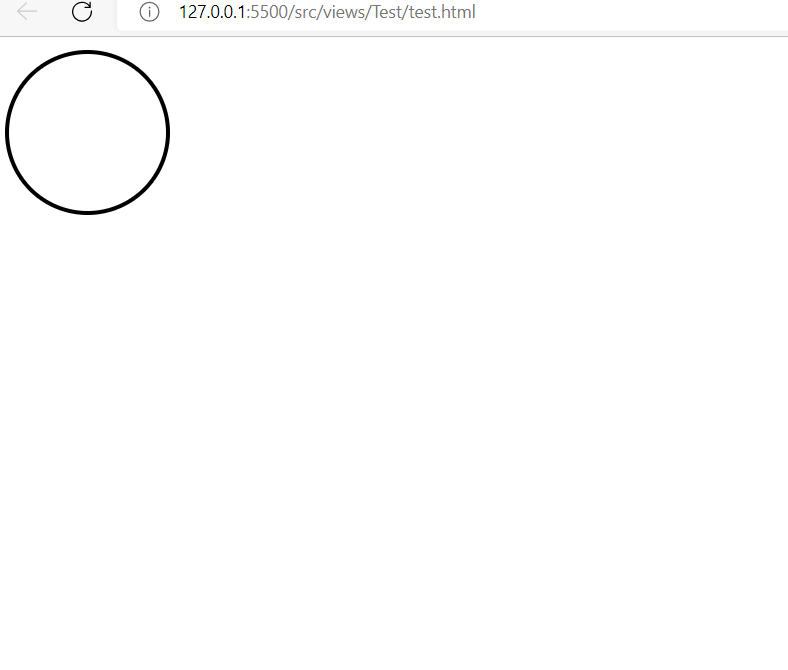
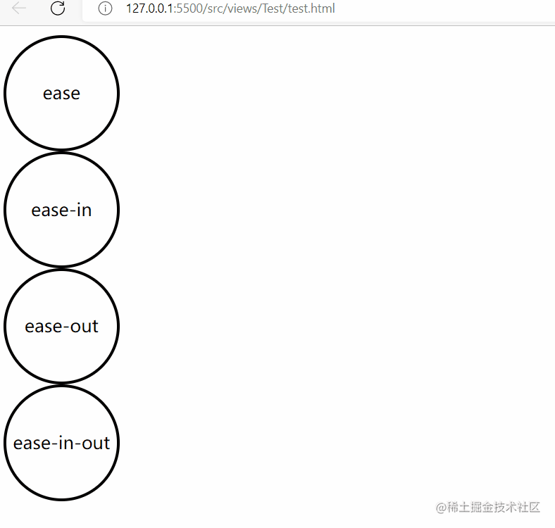
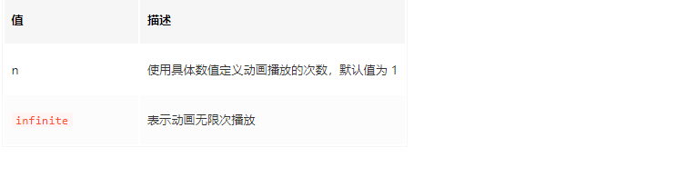
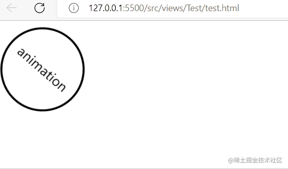
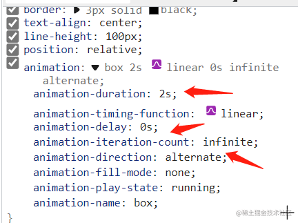

# animation 动画

利用 transition 属性可以实现简单的过渡动画，但过渡动画仅能指定开始和结束两个状态，整个过程都是由特定的函数来控制的，不是很灵活。我们可以使用 animation 实现更为复杂的动画。

CSS 中的动画类似于 flash 中的逐帧动画，表现细腻并且非常灵活，使用 CSS 中的动画可以取代许多网页中的动态图像、Flash 动画或者 JavaScript 实现的特殊效果。

[[TOC]]

### 1. @keyframes 规则—— 动画中的关键帧

要创建 CSS 动画，首先需要了解 `@keyframes` 规则，@keyframes 规则用来定义动画各个阶段的属性值，类似于 flash 动画中的关键帧，语法格式如下：

```css
@keyframes animationName {
  from {
    properties: value;
  }
  percentage {
    properties: value;
  }
  to {
    properties: value;
  }
}
// 或者
@keyframes animationName {
  0% {
    properties: value;
  }
  percentage {
    properties: value;
  }
  100% {
    properties: value;
  }
}
```

语法说明如下：

- `animationName`：表示动画的名称；
- `from`：定义动画的开头，相当于 0%；
- `percentage`：定义动画的各个阶段，为百分比值，可以添加多个；
- `to`：定义动画的结尾，相当于 100%；
- `properties`：不同的样式属性名称，例如 color、left、width 等等。

下面我们来看一个简单的 @keyframes 规则示例：

```css
@keyframes ball {
  0% {
    top: 0px;
    left: 0px;
  }
  25% {
    top: 0px;
    left: 350px;
  }
  50% {
    top: 200px;
    left: 350px;
  }
  75% {
    top: 200px;
    left: 0px;
  }
  100% {
    top: 0px;
    left: 0px;
  }
}
```

动画创建好后，还需要将动画应用到指定的 HTML 元素。要将动画应用到指定的 HTML 元素需要借助 CSS 属性，CSS 中提供了如下所示的动画属性：

- `animation-name`：设置需要绑定到元素的动画名称；
- `animation-duration`：设置完成动画所需要花费的时间，单位为秒或毫秒，默认为 0；
- `animation-timing-function`：设置动画的速度曲线，默认为 ease；
- `animation-fill-mode`：设置当动画不播放时（动画播放完或延迟播放时）的状态；
- `animation-delay`：设置动画开始之前的延迟时间，默认为 0；
- `animation-iteration-count`：设置动画被播放的次数，默认为 1；
- `animation-direction`：设置是否在下一周期逆向播放动画，默认为 normal；
- `animation-play-state`：设置动画是正在运行还是暂停，默认是 running；
- `animation`：所有动画属性的简写属性。

下面就来详细介绍一下上述属性的使用。

### 2. animation-name 动画名称

`animation-name` 属性用来将动画绑定到指定的 HTML 元素，属性的可选值如下：


```html
<!DOCTYPE html>
<html>
  <head>
    <style>
      @keyframes ball {
        0% {
          top: 0px;
          left: 0px;
        }
        25% {
          top: 0px;
          left: 350px;
        }
        50% {
          top: 200px;
          left: 350px;
        }
        75% {
          top: 200px;
          left: 0px;
        }
        100% {
          top: 0px;
          left: 0px;
        }
      }
      div {
        width: 100px;
        height: 100px;
        border-radius: 50%;
        border: 3px solid black;
        position: relative;
        animation-name: ball;
        animation-duration: 2s;
      }
    </style>
  </head>
  <body>
    <div></div>
  </body>
</html>
```

> 注意：要想让动画成功播放，还需要定义 animation-duration 属性，否则会因为 animation-duration 属性的默认值为 0，导致动画并不会播放。


### 3. animation-duration 动画完成一个周期所需要花费的时间

`animation-duration` 属性用来设置动画完成一个周期所需要花费的时间，单位为秒或者毫秒。示例代码如下：

```html
<!DOCTYPE html>
<html>
  <head>
    <style>
      @keyframes ball {
        0% {
          top: 0px;
          left: 0px;
        }
        25% {
          top: 0px;
          left: 350px;
        }
        50% {
          top: 200px;
          left: 350px;
        }
        75% {
          top: 200px;
          left: 0px;
        }
        100% {
          top: 0px;
          left: 0px;
        }
      }
      div {
        width: 100px;
        height: 100px;
        border-radius: 50%;
        border: 3px solid black;
        position: relative;
        animation-name: ball;
        animation-duration: 4s;
      }
    </style>
  </head>
  <body>
    <div></div>
  </body>
</html>
```

运行结果如下图所示

图：animation-duration 属性演示

> 提示：动画若想成功播放，必须要定义 animation-name 和 animation-duration 属性。

### 4. animation-timing-function 动画播放的速度曲线

`animation-timing-function` 属性用来设置动画播放的速度曲线，通过速度曲线的设置可以使动画播放的更为平滑。animation-timing-function 属性的可选值如下表所示：


示例代码如下：

```html
<!DOCTYPE html>
<html>
  <head>
    <style>
      @keyframes ball {
        0% {
          left: 0px;
        }
        50% {
          left: 350px;
        }
        100% {
          left: 0px;
        }
      }
      div {
        width: 100px;
        height: 100px;
        border-radius: 50%;
        border: 3px solid black;
        text-align: center;
        line-height: 100px;
        position: relative;
        animation-name: ball;
        animation-duration: 2s;
      }
      .one {
        animation-timing-function: ease;
      }
      .two {
        animation-timing-function: ease-in;
      }
      .three {
        animation-timing-function: ease-out;
      }
      .four {
        animation-timing-function: ease-in-out;
      }
    </style>
  </head>
  <body>
    <div class="one">ease</div>
    <div class="two">ease-in</div>
    <div class="three">ease-out</div>
    <div class="four">ease-in-out</div>
  </body>
</html>
```

运行结果如下图所示：


### 5.animation-fill-mode （开始播放之前或播放结束之后）动画的状态

`animation-fill-mode` 属性用来设置当动画不播放时（开始播放之前或播放结束之后）动画的状态（样式），属性的可选值如下：


示例代码如下：

```html
<!DOCTYPE html>
<html>
  <head>
    <style>
      @keyframes box {
        0% {
          transform: rotate(0);
        }
        50% {
          transform: rotate(0.5turn);
        }
        100% {
          transform: rotate(1.5turn);
        }
      }
      div {
        width: 100px;
        height: 100px;
        border-radius: 50%;
        float: left;
        border: 3px solid black;
        text-align: center;
        line-height: 100px;
        position: relative;
        animation-name: box;
        animation-duration: 2s;
        animation-iteration-count: 1;
        animation-fill-mode: forwards;
      }
    </style>
  </head>
  <body>
    <div>forwards</div>
  </body>
</html>
```


### 6. animation-delay 动画开始播放前的延迟时间

`animation-delay` 属性用来定义动画开始播放前的延迟时间，单位为秒或者毫秒，属性的语法格式如下：

```css
animation-delay: time;
```

其中参数 time 就是动画播放前的延迟时间，参数 time 既可以为正值也可以为负值。参数值为正时，表示延迟指定时间开始播放；参数为负时，表示跳过指定时间，并立即播放动画。
示例代码如下：

```html
<!DOCTYPE html>
<html>
  <head>
    <style>
      @keyframes ball {
        0% {
          left: 0px;
        }
        50% {
          left: 350px;
        }
        100% {
          left: 0px;
        }
      }
      div {
        width: 100px;
        height: 100px;
        border-radius: 50%;
        border: 3px solid black;
        text-align: center;
        line-height: 100px;
        position: relative;
        animation-name: ball;
        animation-duration: 2s;
      }
      .one {
        animation-delay: 0.5s;
      }
      .two {
        animation-delay: -0.5s;
      }
    </style>
  </head>
  <body>
    <div class="one">0.5s</div>
    <div class="two">-0.5s</div>
  </body>
</html>
```

运行结果如下图所示：


### 7. animation-iteration-count 动画播放的次数

`animation-iteration-count` 属性用来定义动画播放的次数，属性的可选值如下：


示例代码如下：

```html
<!DOCTYPE html>
<html>
  <head>
    <style>
      @keyframes box {
        0% {
          transform: rotate(0);
        }
        50% {
          transform: rotate(0.5turn);
        }
        100% {
          transform: rotate(1turn);
        }
      }
      div {
        width: 100px;
        height: 100px;
        float: left;
        border: 3px solid black;
        text-align: center;
        line-height: 100px;
        position: relative;
        animation-name: box;
        animation-duration: 2s;
      }
      .one {
        animation-iteration-count: 1;
      }
      .two {
        margin-left: 50px;
        animation-iteration-count: infinite;
      }
    </style>
  </head>
  <body>
    <div class="one">1</div>
    <div class="two">infinite</div>
  </body>
</html>
```

运行结果如下图所示：


### 8. animation-direction 是否轮流反向播放动画

`animation-direction` 属性用来设置是否轮流反向播放动画，属性的可选值如下：

示例代码如下：

```html
<!DOCTYPE html>
<html>
  <head>
    <style>
      @keyframes box {
        0% {
          transform: rotate(0);
        }
        50% {
          transform: rotate(0.5turn);
        }
        100% {
          transform: rotate(1turn);
        }
      }
      div {
        width: 100px;
        height: 100px;
        float: left;
        border: 3px solid black;
        text-align: center;
        line-height: 100px;
        position: relative;
        animation-name: box;
        animation-duration: 2s;
        animation-iteration-count: infinite;
      }
      .one {
        animation-direction: reverse;
      }
      .two {
        margin-left: 50px;
        animation-direction: alternate;
      }
    </style>
  </head>
  <body>
    <div class="one">reverse</div>
    <div class="two">alternate</div>
  </body>
</html>
```

运行结果如下图所示：


### 9. animation-play-state 设置动画是播放还是暂停

`animation-play-state` 属性用来设置动画是播放还是暂停，属性的可选值如下：


示例代码如下：

```html
<!DOCTYPE html>
<html>
  <head>
    <style>
      @keyframes box {
        0% {
          transform: rotate(0);
        }
        50% {
          transform: rotate(0.5turn);
        }
        100% {
          transform: rotate(1turn);
        }
      }
      div {
        width: 100px;
        height: 100px;
        float: left;
        border: 3px solid black;
        text-align: center;
        line-height: 100px;
        position: relative;
        animation-name: box;
        animation-duration: 2s;
        animation-iteration-count: infinite;
      }
      .one {
        animation-play-state: running;
      }
      .two {
        margin-left: 50px;
        animation-play-state: paused;
      }
    </style>
  </head>
  <body>
    <div class="one">running</div>
    <div class="two">paused</div>
  </body>
</html>
```

运行结果如下图所示：


### 10. animation 简写形式

`animation` 属性是 `animation-name`、`animation-duration`、`animation-timing-function`、`animation-delay`、`animation-iteration-count`、`animation-direction`、`animation-fill-mode`、`animation-play-state` 几个属性的简写形式，通过 `animation` 属性可以同时定义上述的多个属性，语法格式如下：

```html
示例代码如下：
<!DOCTYPE html>
<html>
  <head>
    <style>
      @keyframes box {
        0% {
          transform: rotate(0);
        }
        50% {
          transform: rotate(0.5turn);
        }
        100% {
          transform: rotate(1turn);
        }
      }
      div {
        width: 100px;
        height: 100px;
        border-radius: 50%;
        float: left;
        border: 3px solid black;
        text-align: center;
        line-height: 100px;
        position: relative;
        animation: box 2s linear 0s infinite alternate;
      }
    </style>
  </head>
  <body>
    <div>animation</div>
  </body>
</html>
运行结果如下图所示：
```


图：animation 属性演示

