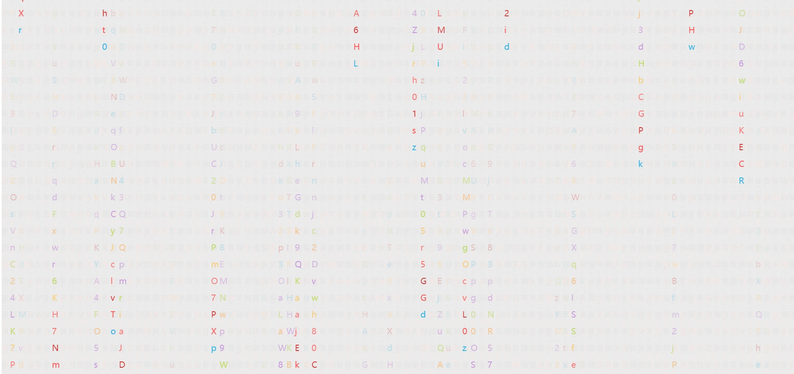

# 代码雨效果

### 最终实现效果



```html
<!DOCTYPE html>
<html lang="en">
<head>
    <meta charset="UTF-8">
    <meta name="viewport" content="width=device-width, initial-scale=1.0">
    <title>Document</title>
</head>
<body>
    <canvas id="bg"></canvas>
    <script>
        //获取canvas原生
        const cvs =document.getElementById('bg')
        //获取窗口尺寸
        const width =window.innerWidth,
        height = window.innerHeight;
        //设置canvas尺寸
        cvs.width =width
        cvs.height =height

        //获取绘制上下文
        const  ctx = cvs.getContext("2d");

        //列宽
        const columnWidth = 20;

        // 列数
        const cloumnCount = Math.floor(window.innerWidth / columnWidth)

        //记录每列写到了第几个文字
        const columnNextIndexs  = new Array(cloumnCount)
        columnNextIndexs.fill(1)
        
        //绘制函数
        function draw(){
             //每次绘制前设置透明色
            ctx.fillStyle = 'rgba(240,240,240,.1)'
            //绘制矩形填充整个屏幕
            ctx.fillRect(0, 0,width,height)
            //字体大小设置
            const fz = 20;
            //填充随机颜色
            ctx.fillStyle = getRandomColor()
            //设置字体
            ctx.font = `${fz}px "Roboto Mono"`
            //循环绘制文字
            for (var i = 0; i <cloumnCount;i++) {
                //坐标x 等于 i * 行宽
                const x = i * columnWidth
                // 坐标y 等于 字体大小 * 当前行的第i个 下标
                const y = fz * columnNextIndexs[i]
                //   填充文本
                ctx.fillText(getRandomChar(),x,y)
                // 当前行第i个++
                columnNextIndexs[i] ++
                // 当 坐标y的高度大于 屏幕告诉 && 随机数大于0.99 就让 当前行的第i个下表设置为 0 否则 ++
                if(y >height && Math.random()>0.99 ){
                    columnNextIndexs[i] = 0
                }else{
                    columnNextIndexs[i]++
                }
            }
        }   

        //随机颜色
        function  getRandomColor(){
            const  fontColors= [
                '#33B5E5',
                '#0099CC',
                '#AA66CC',
                '#9933CC',
                '#99CC00',
                '#669900',
                '#FFBB33',
                '#FF8800',
                '#FF4444',
                '#CC0000',
            ]
            return fontColors[Math.floor(Math.random() * fontColors.length)]
        }
        //随机文字
        function  getRandomChar(){
            const str ='ABCDEFGHIJKLMNOPQRSTUVWXYZ01234567890abcdefghijklmnopqrstuvwxyz'
            return str[Math.floor(Math.random()*str.length)];
        }

        draw()
        setInterval(draw,40)

    </script>
</body>
</html>

```