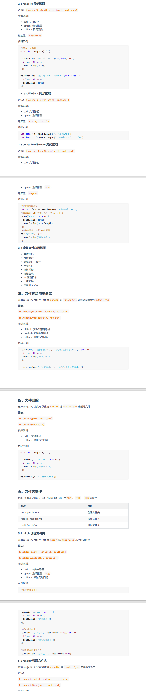
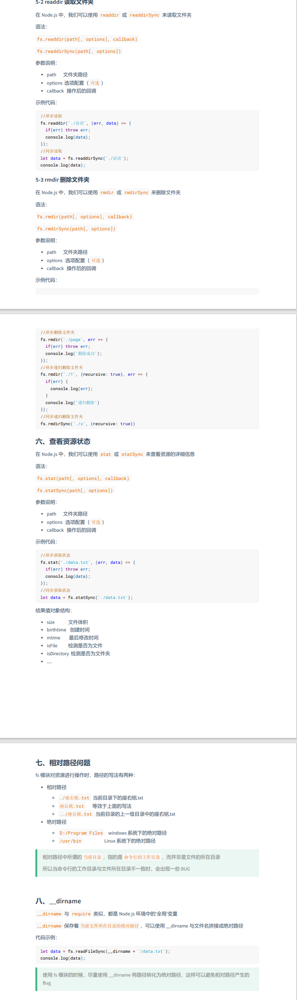
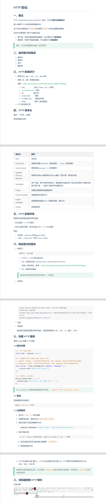
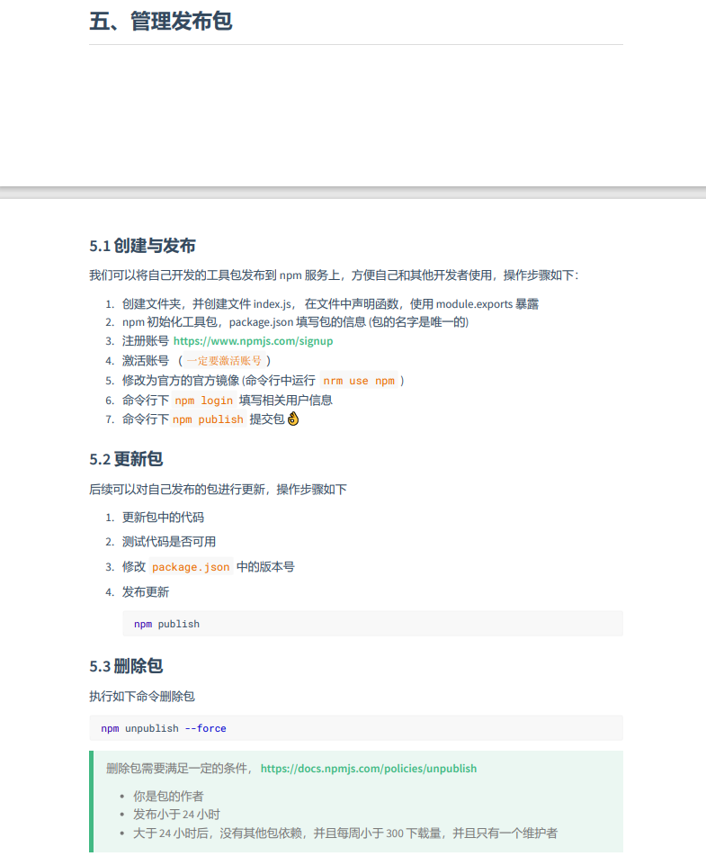
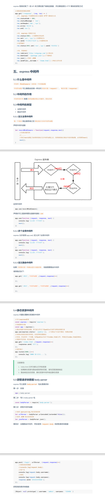
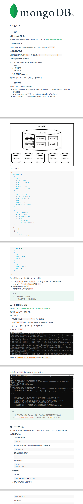

# node知识

[[toc]]

### node fs模块

### node_path 

### node http

### node 模块化

### node npm包管理 发布删除

### node 版本管理 nvm

### node express

### node mongodb

### node 接口 interface

### node 会话控制

