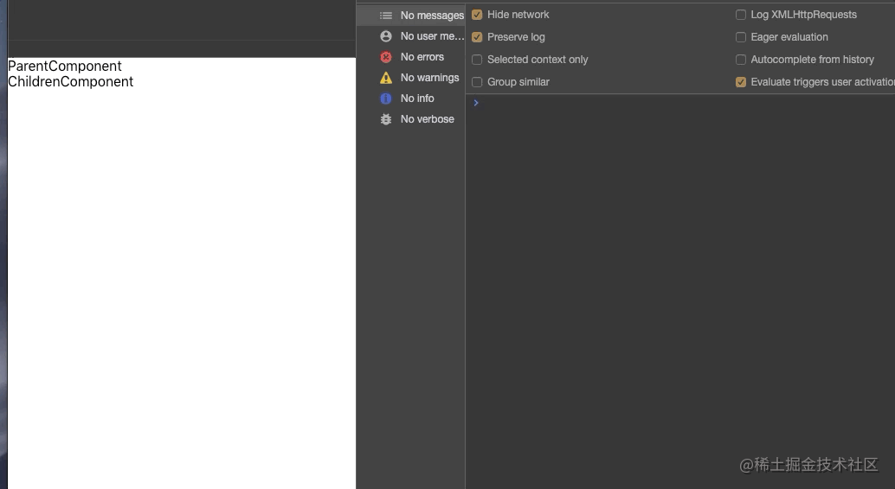
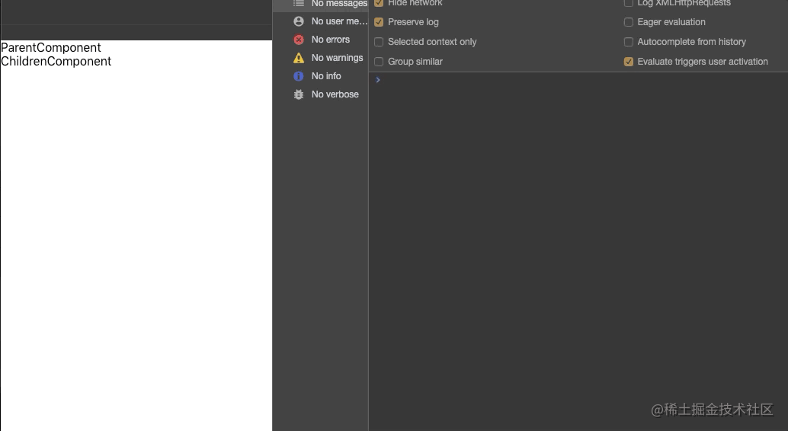

# useMemo 与 useCallback 的区别
[[toc]]

- useCallback
  - useCallback 的参数
  - useCallback 返回值
  - useCallback 使用场景
- useMemo

  - useMemo 的参数
  - useMemo 的返回值
  - useMemo 使用场景

  ### useCallback

  看一下（一定要看完哦，对下面理解很重要），使用 class 写父子组件嵌套，父组件传递一个方法给子组件的场景,下面是一个不理想的写法

```jsx
class ParentComponent extends React.Component {
  constructor(props) {
    super(props);
    this.state = {
      count: 0,
    };
  }
  //这是采用不理想的写法
  handleChildren() {
    console.log("clicked ChildrenComponent");
  }
  //这是采用不理想的写法
  handleParent() {
    console.log("clicked ParentComponent");
    this.setState((preCount) => ({ count: preCount + 1 }));
  }

  render() {
    return (
      <div>
        {/* 这是采用不理想的写法 */}
        <div
          onClick={() => {
            this.handleParent();
          }}
        >
          ParentComponent{" "}
        </div>
        {/* 这是采用不理想的写法 */}
        <ChildrenComponent
          handleChildren={() => {
            this.handleParent();
          }}
        />
      </div>
    );
  }
}

class ChildrenComponent extends React.PureComponent {
  render() {
    const { handleChildren } = this.props;
    console.log("ChildrenComponent rending");
    return <div onClick={handleChildren}>ChildrenComponent </div>;
  }
}
```

有些小伙伴其实已经看到问题所在了，问题出在每次点击 `ParentComponent` 就会导致 `ChildrenComponent` 也渲染一次，虽然 `ChildrenComponent` 采用了 `PureComponent` 优化


当 ParentComponent 组件的 setate 发生改变的时候 render 都会重新渲染一次，ChildrenComponent 的属性 handleChildren 属性采用匿名函数赋值，导致每次的引用地址不一样，那么 ChildrenComponent 使用用 PureComponent 优化是无效的

```jsx
{
  /* 这是采用不理想的写法 */
}
<ChildrenComponent
  handleChildren={() => {
    this.handleParent();
  }}
/>;
```

改正版

```jsx
class ParentComponent extends React.Component {
  constructor(props) {
    super(props);
    this.state = {
      count: 0,
    };
  }
  handleChildren = () => {
    console.log("clicked ChildrenComponent");
  };
  handleParent = () => {
    console.log("clicked ParentComponent");
    this.setState((preCount) => ({ count: preCount + 1 }));
  };

  render() {
    return (
      <div>
        <div onClick={this.handleParent}>ParentComponent </div>
        <ChildrenComponent handleChildren={this.handleChildren} />
      </div>
    );
  }
}

class ChildrenComponent extends React.PureComponent {
  render() {
    const { handleChildren } = this.props;
    console.log("ChildrenComponent rending");
    return <div onClick={handleChildren}>ChildrenComponent </div>;
  }
}
```

点击 ParentComponent 不会导致 ChildrenComponent 也渲染，真正的起到了优化的作用

扯了这么多了，只要你能够明白上面的问题那个 useCallback 的作用也就明白了，话不多说看代码(hook 的写法)

### useCallback 的参数

需要传入两个参数

callback（仅仅是个函数），并把要做事情的函数放在 callback 函数体内执行
deps 要做事情的函数需要引入的外部参数或者是依赖参数

```jsx
const handleChildrenCallback = useCallback(() => {
  handleChildren();
}, []); // 咱们不需要就不要传入
```

#### useCallback 返回值

返回一个 memoized 回调函数。在依赖参数不变的情况下，返回的回调函数是同一个引用地址
注意 每当依赖参数发生改变 useCallback 就会自动重新返回一个新的 memoized 函数（地址发生改变）

#### useCallback 使用场景

上面的优化子组件渲染次数，就是 useCallback 的使用场景，废话不说咱们看看使用怎么做到子组件的优化，咱们先看没有使用 useCallback，子组件的渲染
注意 memo 和 PureComponent 功能相同

```jsx
const ParentComponent = () => {
  const [count, setCount] = useState(0);
  const handleChildren = () => {
    console.log("clicked ChildrenComponent");
  };

  const handleParent = () => {
    console.log("clicked ParentComponent");
    setCount((preCount) => preCount + 1);
  };

  return (
    <div>
      <div onClick={handleParent}>ParentComponent --count =={count} </div>
      <ChildrenComponent handleChildren={handleChildren} />
    </div>
  );
};

const ChildrenComponent = memo(({ handleChildren }) => {
  console.log("ChildrenComponent rending");
  return <div onClick={handleChildren}>ChildrenComponent </div>;
});
```

每次点击 ParentComponent 就会导致 ChildrenComponent 也渲染一次，虽然 ChildrenComponent 采用了 memo 优化，看图


使用 useCallback，来优化 ChildrenComponent 的渲染，看代码

```jsx
const ParentComponent = () => {
  const [count, setCount] = useState(0);
  const handleChildren = () => {
    console.log("clicked ChildrenComponent");
  };
  const handleChildrenCallback = useCallback(() => {
    handleChildren();
  }, []);

  const handleParent = () => {
    console.log("clicked ParentComponent");
    setCount((preCount) => preCount + 1);
  };

  return (
    <div>
      <div onClick={handleParent}>ParentComponent --count =={count} </div>
      <ChildrenComponent handleChildren={handleChildrenCallback} />
    </div>
  );
};

const ChildrenComponent = memo(({ handleChildren }) => {
  console.log("ChildrenComponent rending");
  return <div onClick={handleChildren}>ChildrenComponent </div>;
});
```

点击 ParentComponent 不会导致 ChildrenComponent 渲染，真正的起到了优化的作用 ，看动图


第二参数传入值并且去触发 ChildrenComponent 也渲染,代码思路是每点击三次就会触发 ChildrenComponent 渲染一次

```jsx
const ParentComponent = () => {
  const [count, setCount] = useState(1);
  const [updateChildrenComponentNum, setUpdateChildrenComponentNum] =
    useState(0);
  const handleChildren = (updateChildrenComponentNum) => {
    console.log(
      "clicked ChildrenComponent updateChildrenComponentNum " +
        updateChildrenComponentNum
    );
  };
  const handleChildrenCallback = useCallback(() => {
    handleChildren(updateChildrenComponentNum);
  }, [updateChildrenComponentNum]);

  const handleParent = () => {
    console.log("clicked ParentComponent");
    setCount((preCount) => preCount + 1);
    if (count % 3 === 0) setUpdateChildrenComponentNum((preNum) => preNum + 1);
  };

  return (
    <div>
      <div onClick={handleParent}>ParentComponent --count =={count} </div>
      <ChildrenComponent handleChildren={handleChildrenCallback} />
    </div>
  );
};

const ChildrenComponent = memo(({ handleChildren }) => {
  console.log("ChildrenComponent rending");
  return <div onClick={handleChildren}>ChildrenComponent </div>;
});
```

点击三次就会触发 ChildrenComponent 渲染一次 看图


### useMemo
useMemo有是的作用是什么呢？是避免在每次渲染时都进行高开销的计算的优化的策略，
#### useMemo 的参数
需要传入两个参数

callback（仅仅是个函数），并把要做事情的函数放在callback函数体内执行，（需要有返回值）
deps 要做事情的函数需要引入的外部参数或者是依赖参数

#### useMemo 的返回值


返回一个 memoized 值。在依赖参数不变的的情况返回的是上次第一次计算的值
 注意 每当依赖参数发生改变useMemo就会自动重新计算返回一个新的 memoized值


#### useMemo使用场景

优化针对于当前组件高开销的计算，具有记忆功能

看代码，先演示没有使用useMemo，发现 computeExpensiveValue每次都会重现计算，遇见大的计算量是会很吃内存
```jsx
const ComputeComponent = () => {
  const [count, setCount] = useState(100);
  const [changeNum, setChangeNum] = useState(100);

  function computeExpensiveValue(count) {
    console.log('computeExpensiveValue 被执行');
    //比较大计算
    const array = new Array(count).fill(count);
    return array.reduce((currentTotal, item) => {
      return currentTotal + item;
    }, 0);
  }
  const handleSetCount = () => {
    setCount(preCount => preCount * 2);
  };
  const handleChangeNum = () => {
    setChangeNum(preCount => preCount * 2);
  };
  const computeValue = computeExpensiveValue(count);
  return (
    <div>
      <div>{computeValue}</div>
      <div onClick={handleSetCount}>addCount{count} </div>
      <div onClick={handleChangeNum}> add changeNum {changeNum}</div>
    </div>
  );
};
```
不论我点击 addCount 还是   add changeNum  computeExpensiveValue都会被执行，看图


其实我们不希望在不改变count值的时候去重新执行computeExpensiveValue，使用useMemo，是可以做到，开代码
```jsx
const ComputeComponent = () => {
  const [count, setCount] = useState(100);
  const [changeNum, setChangeNum] = useState(100);
  const computeValue = useMemo(() => computeExpensiveValue(count), [count]);
  function computeExpensiveValue(count) {
    console.log('computeExpensiveValue 被执行');
    //比较大计算
    const array = new Array(count).fill(count);
    return array.reduce((currentTotal, item) => {
      return currentTotal + item;
    }, 0);
  }
  const handleSetCount = () => {
    setCount(preCount => preCount * 2);
  };
  const handleChangeNum = () => {
    setChangeNum(preCount => preCount * 2);
  };
  return (
    <div>
      <div>{computeValue}</div>
      <div onClick={handleSetCount}>addCount{count} </div>
      <div onClick={handleChangeNum}> add changeNum {changeNum}</div>
    </div>
  );
};
```
我们只希望在点击addCount或者是count变化的时候去重新计算，看图


### 不同之处
`useCallback` 优化针对于子组件渲染
`useMemo` 优化针对于当前组件高开销的计算