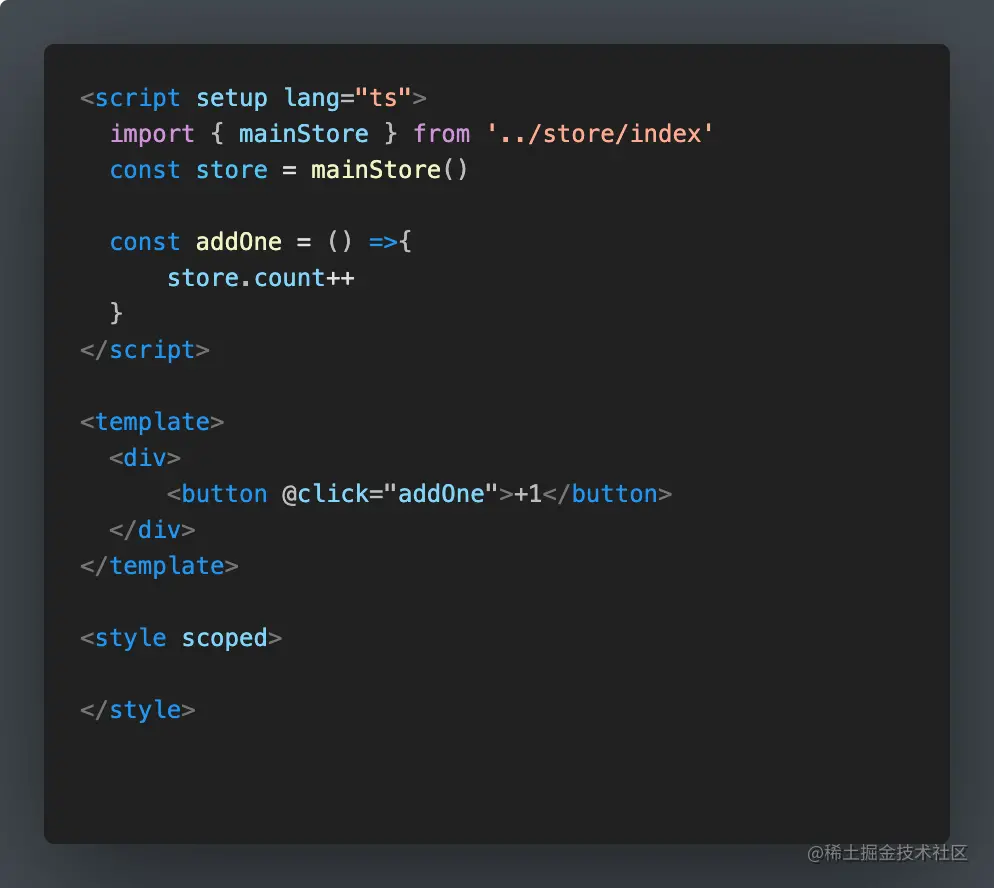
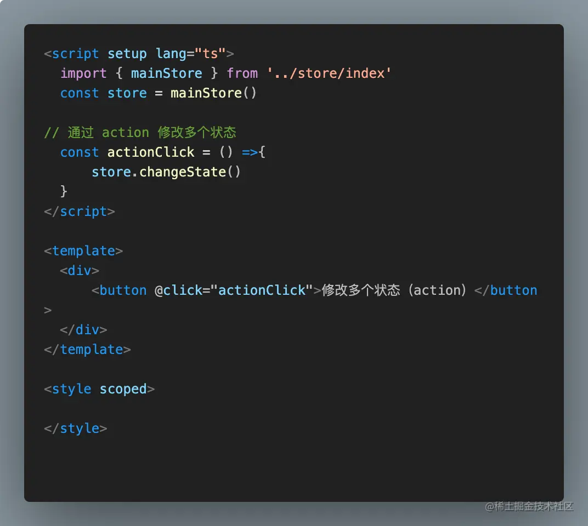

# vue3 大菠萝(pinia)
 [[toc]]


### Pinia优势
Pinia是一个全新的Vue状态管理库，是Vuex的代替者，尤雨溪强势推荐

1. Vue2 和 Vue3 都能支持
2. 抛弃传统的 Mutation ，只有 state, getter 和 action ，简化状态管理库
3. 不需要嵌套模块，符合 Vue3 的 Composition api，让代码扁平化
4. TypeScript支持
5. 代码简介，很好的代码自动分割

### Pinia 基本使用
```js
初始化项目： npm init vite@latest

安装Pinia: npm i pinia
```

#### 挂载Pinia


#### 创建Store


#### 使用Store


### 解构store
当store中的多个参数需要被使用到的时候，为了更简洁的使用这些变量，我们通常采用结构的方式一次性获取所有的变量名

#### ES传统方式解构(能获取到值，但是不具有响应性)


#### Pinia解构方法：storeToRefs


### Pinia修改数据状态
#### 简单数据修改
简单数据直接通过在方法中操作 store.属性名 来修改


#### 多条数据修改

通过基础数据修改方式去修改多条数据也是可行的，但是在 pinia 官网中，已经明确表示$patch 的方式是经过优化的，会加快修改速度，对性能有很大好处，所以在进行多条数据修改的时候，更推荐使用 $patch
$patch 方法可以接受两个类型的参数，函数 和 对象<br/>
$patch + 对象 <br/>
$patch + 函数： 通过函数方式去使用的时候，函数接受一个 state 的参数，state 就是 store 仓库中的 state


#### 通过action修改
* Store.actions中添加 changeState 方法


* 组件方法调用 store.方法名



### Pinia中的Getters
Pinia 中的 getter 和 Vue 中的计算属性几乎一样，在获取 State值之前做一些逻辑处理

getter 中的值有缓存特性，如果值没有改变，多次使用也只会调用一次

#### 添加 getter方法

#### 组件内多次调用


#### getter 中不仅可以传递 state 直接改变数据状态，还可以使用 this 来改变数据


###  store之间的相互调用
在 Pinia 中，可以在一个 store 中 import 另外一个 store ，然后通过调用引入 store 方法的形式，获取引入 store 的状态

##### 新建 store

#### 在原 store 中引入 allanStore，并获取 moveList

#### 组件中使用 mainStore.getAllanStoreList


### 总结
总得来说，Pinia 就是 Vuex 的替代版，可以更好的兼容 Vue2，Vue3以及TypeScript。在Vuex的基础上去掉了 Mutation，只保留了 state, getter和action。Pinia拥有更简洁的语法， 扁平化的代码编排，符合Vue3 的 Composition api
